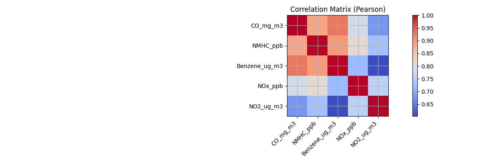

# Phase 2 Report: Advanced Environmental Data Intelligence and Pattern Analysis

## Executive Summary
This phase focused on performing exploratory data analysis (EDA) and advanced analytics on air quality data.  
We examined pollutant trends, cyclical patterns, correlations, and anomalies to uncover actionable insights that inform predictive modeling.

Key findings:
- Strong **daily and weekly cycles** in pollutants, driven by traffic and human activity.  
- **High correlations** between CO, NMHC, and Benzene, indicating shared emission sources.  
- Evidence of **seasonal variation** and long-term declining trends in some pollutants.  
- Clear **anomalous events** flagged where pollutant spikes deviated from normal seasonal behavior.  

These results confirm the dataset’s suitability for predictive modeling, while highlighting the need for careful feature engineering and anomaly handling.

## Data Preparation
- Parsed raw UCI-format dataset (Date/Time split, `-200` as missing).  
- Converted to hourly frequency (`clean_hourly.csv`).  
- Handled missing values and renamed pollutants for clarity:  
  - CO → `CO_mg_m3`  
  - NMHC → `NMHC_ppb`  
  - C6H6 → `Benzene_ug_m3`  
  - NOx → `NOx_ppb`  
  - NO2 → `NO2_ug_m3`  

## Exploratory Data Analysis (EDA)

### 1. Time Series Visualizations
  
  

- Long-term declining trend in CO and Benzene, likely reflecting cleaner vehicles/policies.  
- NOx and NO2 show strong fluctuations tied to urban traffic cycles.  

### 2. Daily Cycles
  

- Morning peaks (~7–9 AM) across CO, NOx, Benzene correspond to rush-hour traffic.  
- Evening secondary peaks (~6–8 PM) also visible.  

### 3. Weekly Cycles
  

- Weekday concentrations higher than weekends.  
- Clear reduction in pollutants on Saturday/Sunday → strong evidence of traffic influence.  

### 4. Cross-Pollutant Correlations
  

- **CO ↔ Benzene:** r ≈ 0.93 (very strong).  
- **CO ↔ NMHC:** r ≈ 0.89.  
- **NOx ↔ NO2:** r ≈ 0.76.  
- Suggests common sources (vehicle exhaust), enabling multi-pollutant predictive features.  

## Advanced Analytics

### 1. Autocorrelation & Partial Autocorrelation
  

- ACF shows strong persistence at 24-hour lags → daily cycles dominate.  
- PACF suggests dependencies fade after a few lags → useful for short-term forecasting models.  

### 2. STL Decomposition
Example (Benzene):  
- **Trend:** gradual long-term decline.  
- **Seasonal:** repeating daily/weekly cycles.  
- **Residual:** short-term unexplained variability (candidate anomalies).  

  
  

### 3. Anomaly Detection
Anomalies flagged where pollutant levels exceeded **3σ from the seasonal mean**.  
- Example: Benzene spikes in evenings beyond expected cycle.  
- Important for both **data cleaning** and **event detection applications**.  

## Data Quality Issues
- Missing values (`-200`) in raw dataset → treated as NA.  
- Occasional extreme spikes flagged as anomalies.  
- Seasonal patterns may confound trend detection if not explicitly modeled.  

## Business & Policy Insights
- **Traffic is the dominant driver** of pollution variation (daily & weekly cycles).  
- **Cross-pollutant dependencies** mean interventions reducing one (e.g., CO) likely reduce others.  
- **Anomaly spikes** could signal pollution events worth alerting (industrial release, weather inversion).  

## Modeling Strategy
- Use **time-based features**: hour of day, day of week, seasonal components.  
- Include **lagged pollutant values** (from ACF/PACF insights) as predictors.  
- Consider **multi-pollutant models** leveraging correlations.  
- Handle anomalies carefully:  
  - Exclude if modeling *baseline* air quality.  
  - Keep if predicting *alerts/spikes*.  

## Conclusion
Phase 2 established a robust understanding of the dataset’s temporal dynamics and pollutant relationships.  
We now have:  
- Clear evidence of daily/weekly cycles.  
- Quantified cross-pollutant correlations.  
- Trends, seasonality, and anomalies mapped.  

This provides a strong foundation for Phase 3: **building predictive models** that leverage these temporal and relational structures for real-time air quality forecasting.

**Note: Additional information regarding the strategic analysis report can be found in the PDF version called `Phase 2 Strategic Analysis Report.pdf` within the Phase 2 folder**

## Academic Integrity Note

This assignment was completed with the use of generative AI (OpenAI ChatGPT, GPT-5, September 2025).  
Prompts and responses are documented in **Appendix A** (`appendix_ai_usage/appendix_kafka.txt`).